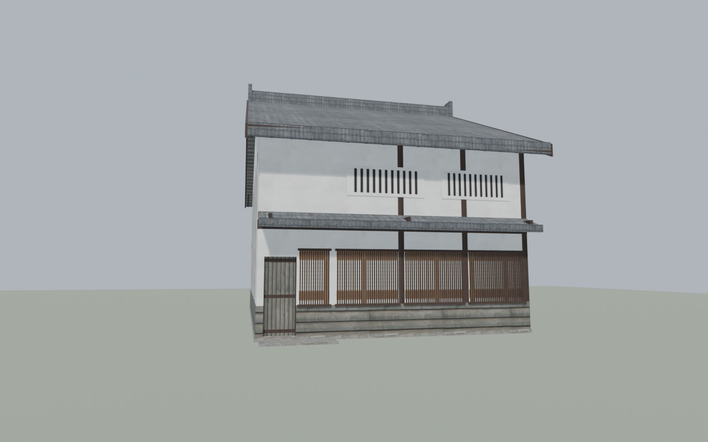

# Spike B: an enterable machiya from a parametric Blender kit

(The agent returned this as text because subagents can't write report files; the lead saved it on 2026-09-27.)

**Status:** built and verified offline. Nothing has been tested in game yet.

- `Land_JP_Machiya_01` is the spike building: 2 storeys, 4 × 6 ken, 7 sliding doors, a box stair and 28 loot points.
- `Land_JP_Machiya_02` proves the kit: 1 storey, 3 × 4 ken, earth walls, the passage mirrored to the other side.

`verify_b.py` passes with 0 failures. The binarize log is clean apart from the stock `P:\bin` noise (the Pokemon
pipeline's logs show the same lines).



## Built

**Game files**

| File | What |
|---|---|
| `..\@Japan\addons\jp_structures.pbo` | Prefix `JP\structures`, CfgPatches `JP_Structures`, 67 files, 19 MB |
| `src/JP/structures/config.cpp` | `Land_JP_Machiya_01` and `Land_JP_Machiya_02`, both `: HouseNoDestruct`, `scope=1`. Each has `class Doors` and a vanilla-style `DamageSystem` with one zone per door |
| `src/JP/structures/machiya/jp_machiya_01.p3d`, `jp_machiya_02.p3d` | ODOL v55, binarized. LODs: Res 1/2/3, Geometry, Memory, Roadway, View Geometry, Fire Geometry |
| `src/JP/structures/machiya/model.cfg` | One skeleton per model, one bone per door, `type="translation"` animations sourced from `DoorsN`. Not packed: binarize bakes it into the ODOL |
| `src/JP/structures/data/` | 16 texture sets (`_co`, `_nohq`, `_smdi` .paa) and one Super-shader `.rvmat` per set |

**Drop-in files**

| File | What |
|---|---|
| `test/placements/B.csv` | `JP\structures\machiya\jp_machiya_01.p3d,1024.000,1045.000,180.0,0.0` (terrain-baked) |
| `test/spawns/B.json` | `Land_JP_Machiya_01` at `[1075, 25.0, 1090]`, ypr `[180,0,0]` (runtime spawn) |
| `test/ce/B_mapgroupproto.xml` | Group `Land_JP_Machiya_01`, usage Town + Village, container `lootFloor` (tools/containers/clothes/food, tag floor), 28 points |
| `test/ce/B_mapgrouppos.xml` | Both instances: `pos="x 25.0 z" rpy="0 0 180" a="-90"` |

**The kit** (`spikes/B_building/`)
- `kit/build_building.py` is the Blender entry point. Per variant it generates the model, writes the MLOD p3d, the
  model.cfg and config fragments, the loot group and `out/<name>/<name>_summary.json`, saves the `.blend` and
  renders.
- `kit/variants.py` holds the building list, as parameter sets.
- `kit/jpkit/` is pure Python:
  - `machiya.py`: the generator
  - `geom.py`: convex prisms, per-face materials and UVs
  - `p3d.py`: every LOD
  - `cfg.py`: model.cfg and config.cpp
  - `loot.py`: generated loot points and the CE transform
  - `materials.py`
- **Parameters:**
  - `width_ken`, `depth_ken`, `storeys` (1 or 2)
  - `toriniwa_ken`, `toriniwa_side` (east or west)
  - `rooms[]`: depth in ken, `floor` (tatami or boards), `irori`, `stair`, `toriniwa_door`, `toriniwa_door_at`,
    `window_back`
  - `link_doors[]` (true, false or a position fraction), `entrance_at` (party or rooms)
  - Roof: `roof` (only `kirizuma`), `roof_pitch`, `eave_overhang`, `gable_overhang`, `hisashi`
  - Walls: `walls` (white or earth), `interior_walls`, `lower_walls` (boards or plaster), `front` (koshi),
    `upper_front` (mushiko)
  - Floor, ceiling and eave heights, door sizes, `stair_angle`, `mass`
- **Tools:**
  - `tools/mlod_b.py`: my copy of `tools/common/mlod.py`, with building helpers added
  - `fetch_textures.py`, `make_textures.py`
  - `build_b.py`: PAA, rvmat, config, CfgConvert, binarize, pack and the drop-ins
  - `verify_b.py`
- **Outputs:**
  - `out/<name>/`: MLOD p3d, `.blend`, summary, fragments
  - `out/binarize.log`
  - `renders/*.jpg`: 43 views

**Rebuild:** under 2 minutes, without touching the server.

```
blender --background --python spikes/B_building/kit/build_building.py -- jp_machiya_01 jp_machiya_02
python spikes/B_building/tools/build_b.py
python spikes/B_building/tools/verify_b.py
```

`make_textures.py` only needs to rerun if the textures change.

**Machiya 01 layout.** The toriniwa runs down the model's +x side. With yaw 180 that is the world **west** side, on
your left as you face the front from the spawn.

- **Earthen passage (toriniwa):** 1 ken wide, full depth. It has a clay stove (kamado) and open double height up to
  the roof beams.
- **Room 1, front:** tatami, raised 40 cm (mise-no-ma).
- **Room 2, middle:** board floor with a sunken hearth (irori). The box stair runs along its back wall.
- **Room 3, back:** tatami, with a shoji window.
- **Upstairs:** two board-floored rooms under the open roof, with a railed stairwell.
- **Outside:** kawara gable roof with deep eaves, ridge and end tiles, a tiled pent roof (hisashi) over the street
  front, a koshi lattice, slatted mushiko windows, and a stone plinth and aprons.
- **Footprint:** 8.1 × 12.7 m including the eaves, ridge at 8.5 m.

## Verified offline

- **`verify_b.py`: PASS, 0 failures, both variants.**
  - All 8 LODs are present, matching the vanilla house set.
  - Geometry has `class=house`, `map=house`, `damage=no`, `autocenter=0`, and mass (60 t for 01).
  - Every component in Geometry (58), View (51) and Fire (56) is closed and convex. Every face belongs to a
    component.
  - Fire materials are only vanilla penetration rvmats.
  - **Doors, per door:**
    - its `doorsN` selection is in Res 1-3, Geometry, View and Fire, and in the three geometry LODs it is exactly one
      component
    - memory `doorsN_axis` is 2 points, exactly 1.00 m apart along the slide direction; `doorsN_action` and the
      `doorsN` leaf point exist
    - the model.cfg animation and the config `Doors` class exist
    - the swept box from closed to open touches no other Geometry component
    - with the leaf open, a 0.6 × 1.8 m column through the doorway is clear
  - **Floors and stair:**
    - Roadway sits on top of Geometry at all 325 samples, within 3 cm.
    - Every walkable floor sample has roadway at floor height (1262 samples).
    - Head room is at least 2.25 m over floors and at least 2.24 m along the stair.
  - **Loot and ODOL:**
    - Loot points lie on roadway, and their range circles stay clear of walls.
    - The CE-frame to world transform matches model to world for both instances (max 4e-7 m).
    - The ODOL has the right LOD list, door bones and axes, and the skeleton name, which proves model.cfg was
      applied.
- **Binarize:** `out/binarize.log`.
  - `BoundingCenter 0.00,0.00` for both models, so `autocenter=0` took and the model origin is the placement point.
  - The remaining warnings are the stock `P:\bin` ones: `No entry .CfgDefaultSettings`, `Terrain grid`,
    `PreloadConfig`, `TexMaterial loading race`. The Pokemon build logs show the same lines.
- **CfgConvert:** config.cpp and model.cfg both OK.
- **Renders I looked at:**
  - Exterior: `res1_street`, `res1_back`, `res1_3q`, and `res2_3q` / `res3_3q` for the other LODs
  - Cutaways: `plan_ground_*` and `plan_upper_*` (plan cuts), `section_res1`, `section_res1_doors_open`
  - Interior: `interior_stair`, `interior_toriniwa`, `interior_upper`
  - Other LODs: `geometry_3q`, `viewgeometry_3q`, `firegeometry_3q`, `section_geometry`, `plan_ground_geometry`,
    `roadway_ground_3q`, `roadway_all_3q`
  - Memory: `plan_*_memory` (axes, action and leaf points)
  - Loot: `plan_*_loot`
  - Doors: `plan_ground_doors_open` against `_closed`, which confirmed every leaf slides the intended way
  - The same set for 02
- **PBO:** listing checked with `pbo.py list`. It holds config.cpp, both ODOL p3ds, 48 paa and 16 rvmat. There is no
  model.cfg in it.

## In-game checklist for Stephen

**Setup:**
- Server and client load `@Japan`, which includes `jp_structures.pbo`.
- T's rebuilt world bakes `B.csv`.
- `cfggameplay.json` lists `B.json` in `objectSpawnersArr`, and `enableCfgGameplayFile=1` is set.
- The CE files are merged.

Both houses face south, towards the spawn. Their entrance is at the **left (west) end** of the front.

1. **Look.** From the spawn (1024, 985), face north. The house stands about 55 m ahead: grey tile roof, white upper
   storey with two slatted windows, a small tiled pent roof, a wooden lattice front, and a plank door at the left.
   - **Pass:** it sits flush on the ground; the stone step at the door is level with the grass (5 cm step). Nothing
     floats, nothing is purple or black, no faces are missing.
   - The second copy stands at (1075, 1090), about 70 m to the north-east. **Pass:** it looks identical.
2. **Doors.** There are 7 per house. Press F on each to open it, then again to close it. Coordinates are for the
   baked copy; the spawned copy is +51 x, +45 z.

   | Door | Where | Width |
   |---|---|---|
   | Doors1 | Front entrance (1020.9, 1039.5) | 0.80 m |
   | Doors2 | Back door (1020.9, 1050.5) | 0.80 m |
   | Doors3 | Shoji from the passage into the front room (1022.2, 1041.4) | 1.0 m |
   | Doors4 | Shoji from the passage into the middle room (1022.2, 1044.5) | 1.0 m |
   | Doors5 | Fusuma, front room to middle room (1024.9, 1043.2) | 1.0 m |
   | Doors6 | Fusuma, middle room to back room, at the far end beside the stair top (1027.0, 1046.8) | 1.0 m |
   | Doors7 | Upstairs fusuma, same spot, 2.65 m higher | 1.0 m |

   - **Pass:** the leaf slides **sideways along the wall** by its own width and fully clears the opening, then
     returns. No leaf passes through a post, wall or the stair. A wooden slide sound plays. You fit through the
     doorway.
   - **Fail:** the leaf slides the wrong way, into the jamb. That means the engine reads the axis points the other
     way round. It is a one-line fix in the kit.
3. **Walk.**
   - Go in the front door and along the earthen passage to the back door and back.
   - Step up at the flat stones into the front room and the middle room. There is a hidden ramp under each stone.
   - The box stair runs along the back wall of the middle room, its foot next to the passage. Walk up it (it is
     steep, about 38°).
   - At the top, go around the stairwell railing and through Doors7 into the upper back room. Then come back down.
   - **Pass:**
     - you never fall through a floor
     - you never stick on the stones or the steps, and you don't bounce on the stair
     - your head doesn't clip the upper floor while climbing
     - you can't fall into the stairwell from the side (the railing blocks you)
4. **Loot.** With the CE running on fresh storage or after a loot cycle, look for items on the floors of all 6 areas:
   the 3 ground rooms, the passage and the 2 upper rooms. There are 28 points per house.
   - **Pass:** nothing floats, nothing sits half inside the tatami, nothing is inside a wall.
   - Check both copies.
5. **Bullets.** Use a rifle.
   - Shoot a plaster wall from outside, on the ground floor and the upper floor. **Pass:** you see impact effects and
     the bullet does not come out the other side (the material is `dirt`, earthen wall).
   - Shoot the roof. **Pass:** it stops the bullet.
   - Shoot a shoji or fusuma. **Expected:** the bullet passes through, because it is paper (`fabric_thin`).
6. **LODs.** Keep the house in view while moving away to about 300 m, or zoom out.
   - **Pass:** it steps down to a simpler model. First the lattice becomes a flat panel, then the interior goes. No
     flashing holes, and the house never vanishes.
7. **Both instances.** Repeat steps 2-4 quickly at (1075, 1090). **Pass:** it behaves the same, including loot.

## Failed / unknown

- **Nothing tested in game.** All of these are unknown until the bundled check:
  - **Door slide direction.** It relies on the engine taking axis point 1 → point 2 as the direction; the MLOD stores
    them in that order. The slide distance is safe either way: the axis is exactly 1 m, so `offset1` is metres under
    either reading of translation offsets.
  - **Walkability of the ramps.** The stair walk ramp is 37.8° and the step-up ramps are 33.7°. If the stair is too
    steep, set `stair_angle` to 35. At 35° the stair top reaches further west, so Doors6 and Doors7 need moving east
    of the stair foot, which is a small kit change.
  - **Front and back door width.** The clear width is 0.80 m, because a 1-ken passage must hold both the opening and
    the parked leaf. Vanilla doors are about 1.2 m. Setting `toriniwa_ken: 1.25` widens them.
- **Normal maps** use Poly Haven's DirectX (`nor_dx`) variant. DayZ's green-channel convention is unconfirmed; if it
  is wrong, bumps look inverted, which is cosmetic.
- **No Paths LOD.** barn_brick2 has none either. Infected pathing into the baked copy depends on T's navmesh; the
  spawned copy gets `ECE_UPDATEPATHGRAPH` from the vanilla spawner.
- **The BI wiki page "DayZ:Doors_on_buildings"** returns 403 (Cloudflare), and web.archive.org is unreachable from
  here. I used these instead:
  - Bohemia's DayZ-Samples `Test_Building` MLOD, config and model.cfg, whose conventions I verified by reading the
    MLOD
  - vanilla configs and scripts: `ActionOpenDoors`, `IsInReach`, `ActionTargets` (which raycasts View Geometry),
    `ObjectSpawnerHandler`
  - a community mirror summary (StarDZ-Team DayZ-Modding-Wiki)
- **Only the `kirizuma` roof is implemented**; other roof types raise an error.
- **The irori and kamado are visual only.** They are not working fireplaces.
- **The PBO is 19 MB.** The 1k normal maps (DXT5) are the bulk of it.

## Decisions I made

1. **Orientation and origin.**
   - The street front faces model +z, so placement yaw is 180 to face south.
   - The origin is the footprint centre at grade, with `autocenter=0`. So `y_offset = 0` in B.csv, and y = 25.0 in
     the spawner and mapgrouppos.
   - binarize confirmed the bounding centre is 0,0.
2. **Plan.**
   - Three ground rooms front to back: tatami, then boards with irori and stair (the daidokoro), then tatami. The two
     tatami rooms are the required ones. The board floor for the hearth room is authentic.
   - Two rooms upstairs. The passage is open to the roof (fukinuke).
   - 7 doors: 2 plank itado, 2 shoji, 3 fusuma.
3. **Door sizes.**
   - Interior openings are 1.0 × 2.0 m. Real shoji are about 0.9 × 1.76 m, but vanilla doors are about 1.2 × 2.2 m.
   - Front and back are 0.80 × 2.0 m, the most a 1-ken passage allows.
   - Leaves overlap each jamb by 2 cm and run 1.2 cm off the wall face. Slide = leaf width: 0.838 m and 1.04 m.
4. **Door config.**
   - Sounds are `doorWoodSlide*` for all doors. These are vanilla's sliding wooden doors (rail warehouse);
     `doorWoodSlideBig` is barn-scale and too heavy.
   - `animPeriod` is 1.0 for plank doors and 0.8 for paper doors. `initOpened` is 0.3 and 0.5 respectively.
   - The leaf memory point moves with its bone, so `IsInReach` measures to the leaf wherever it is.
5. **Floor heights and walking.**
   - The 40 cm step-up into the rooms uses a hidden 0.6 m ramp in Geometry and Roadway, under a visible stepping stone
     (kutsunugi-ishi).
   - The stair has 12 visual steps of 0.221 m at 40°. It is walked on a ramp over the nosings (Geometry wedge plus
     Roadway quad).
   - The stairwell is sized for 2.05 m head room, with a railing in Geometry.
6. **Fire and roadway surfaces.**
   - Fire materials: plaster walls use `dirt` (earthen tsuchikabe, the lowest penetrability), timber and boards `wood`,
     roof `pottery`, paper doors `fabric_thin`, stone `granite`.
   - Roadway surfaces: `dirt_int` on the doma, `textile_carpet_int` on tatami, `wood_planks_int` on boards,
     `wood_planks_stairs_int` on the stair, and `stone_ext` on the aprons and ramps.
7. **LODs.**
   - Resolution values 1/2/3, as in vanilla `house_1w01`: 2019, 777 and 262 faces.
   - Res2 swaps the lattice slats for a textured panel and the stair for 2 blocks, and drops small detail.
   - Res3 is the shell with the facade panels.
   - No Shadow LOD, because none of the 9 vanilla houses and barns I checked has one. No Paths or HitPoints LOD.
8. **Geometry.**
   - Named properties are `class=house`, `map=house` and `damage=no`, as in the vanilla ODOL. `autocenter=0` is added.
   - Mass is spread evenly over the Geometry points.
   - Door selections are written before `ComponentNN` in every LOD, the same order as the sample.
9. **Config.**
   - `scope=1`, like vanilla `Land_` classes. The vanilla spawner's own example spawns a scope=1 house.
   - `requiredAddons` is `DZ_Data` and `DZ_Structures_Residential`.
   - Door damage zones copy vanilla `Land_House_1W01`.
10. **Loot.**
    - One `lootFloor` container, usage Town + Village.
    - About one point per 5 m², 0.4 m from walls and obstacles, at least 1.3 m apart.
    - Range 0.3-1.2 m; height is 2.5 × range, capped at 2.0 (the vanilla ratio).
    - No shelf or weapon containers: the interiors have no shelves yet.
11. **Textures.**
    - Poly Haven CC0 at 1k, recoloured for a Japanese palette. Shoji, fusuma, plank door, lattice, slatted window,
      tansu and ash are procedural.
    - The rvmats follow the vanilla Super-shader stage layout. Stages 3 and 4 use `uvSource="tex"` because there is no
      second UV set.
12. **File placement.**
    - Generated PNG textures live in `data/B/textures` (git-ignored, regenerable) and renders are JPEG, both to keep
      git small.
    - The drop-ins are bare lines and elements with no comments, so T's merge sees exactly the README format.
13. **Variant 02** was built as the kit proof: 1 storey, 3 × 4 ken, west passage, earth walls. It is also in the PBO
    as `Land_JP_Machiya_02`, but it is not placed.

## Next step

1. **Stephen's bundled check** (above). If a door direction or ramp slope is wrong, fixing it is about 0.3 agent
   session: one kit parameter or line, then about 2 minutes to rebuild.
2. **Grow the kit into a building library**, about 1 session per 2-3 families:
   - hip and hip-and-gable roofs (yosemune, irimoya) and thatch
   - farmhouse minka with a big doma and irori
   - kura storehouse: thick walls, fire shutters
   - nagaya row houses
   - shop fronts with noren
3. **Polish**, about 0.5 session each:
   - a baked far LOD (a Res 4 with a single texture, as vanilla barns have)
   - shelf and tokonoma loot containers
   - a Paths LOD, if infected don't enter
   - a texture atlas to cut the PBO size
